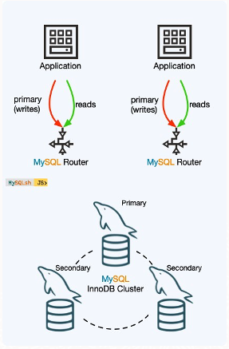

# DEPLOYING - InnoDB Cluster

## Introduction

InnoDB Cluster:
Objective: deploying MySQL sandboxes and then creating an InnoDB Cluster



*This lab walks you through creating MySQL Sandboxes, deploying InnoDB Cluster, bootstrapping MySQL Router and testing failovers

Estimated Time: 15 minutes


### Objectives

In this lab, you will  do the followings:
- Connect to MySQL Shell
- Create MySQL Sandboxes
- Create InnoDB Cluster 

### Prerequisites

This lab assumes you have:
* An Oracle account
* All previous labs successfully completed

### MySQL Instances ports
* "Portland": 3310, 3320, 3330

### Lab standard  

   *  shell> the command must be executed in the Operating System shell
   *  mysql> the command must be executed in a client like MySQL, MySQL Workbench
   *  mysqlsh> the command must be executed in MySQL shell
    

## Task 1: Connect to mysql-enterprise on Server

1. Connect to your MySQL Shell

   ** shell>** 

    ```
    <copy>mysqlsh --js</copy>
    ```

2. Create 3 MySQL Sandboxes 

	a. ** mysqlsh>** 

    ```
    <copy>dba.deploySandboxInstance(3310, {password: "password"})
    dba.deploySandboxInstance(3320, {password: "password"})
    dba.deploySandboxInstance(3330, {password: "password"})</copy>
    ```

	b. ** mysqlsh>**

    ```
    <copy>\quit</copy>
    ```

    e.	Load some sample data

	** shell>** 

    ```
    <copy>mysql -P3310 --protocol=tcp -uroot -ppassword -e"CREATE DATABASE world"</copy>
    ```

	** shell>** 

    ```
    <copy>mysql -P3310 --protocol=tcp -uroot -ppassword world < ~/workshop/world_innodb.sql</copy>
    ```

## Task 2: Create InnoDB Cluster 

1. Connect to your MySQL Shell

   ** shell>** 

    ```
    <copy>mysqlsh --js</copy>
    ```

2. Using the MySQL Shell Connection, connect the Shell to Sandbox on Port 3310 and create InnoDB Cluster

	a. ** mysqlsh>**

    ```
    <copy>\connect root@localhost:3310</copy>
    ```

	b. ** mysqlsh>**

    ```
    <copy>\sql</copy>
    ```

	c. Search for non-InnoDB tables

    ** mysqlsh>**

    ```
    <copy>SELECT table_schema, table_name, engine, table_rows, (index_length+data_length)/1024/1024 AS sizeMB
          FROM information_schema.tables
          WHERE engine != 'innodb'
          AND table_schema NOT IN ('information_schema', 'mysql', 'performance_schema');</copy>
    ```

	d. Search for InnoDB tables without Primary or Unique Keys:

    ** mysqlsh>**

    ```
    <copy>SELECT tables.table_schema, tables.table_name, tables.engine, tables.table_rows
          FROM information_schema.tables
            LEFT JOIN (select table_schema, table_name
          FROM information_schema.statistics
           GROUP BY table_schema, table_name, index_name HAVING
          SUM(CASE
            WHEN non_unique = 0
            AND nullable != 'YES' then 1 ELSE 0
            END
               ) = count(*)
             ) puks
          ON tables.table_schema = puks.table_schema
          AND tables.table_name = puks.table_name 
          WHERE puks.table_name is null
             AND tables.table_type = 'BASE TABLE'
             AND engine='InnoDB'
             AND tables.table_schema NOT IN ('information_schema', 'mysql', 'performance_schema');</copy>
    ```

	e. ** mysqlsh>**

    ```
    <copy>\js</copy>
    ```

	f. ** mysqlsh>**

    ```
    <copy>var PortlandCluster = dba.createCluster("PortlandCluster")</copy>
    ```

	g. ** mysqlsh>**

    ```
    <copy>PortlandCluster.status()</copy>
    ```

2. Add 2 instances to InnoDB Cluster

    a. ** mysqlsh>**

    ```
    <copy>PortlandCluster.addInstance('root@localhost:3320')</copy>
    ```

	b. ** mysqlsh>**

    ```
    <copy>PortlandCluster.addInstance('root@localhost:3330')</copy>
    ```

	c. ** mysqlsh>**

    ```
    <copy>PortlandCluster.status()</copy>
    ```

	d. ** mysqlsh>**

    ```
    <copy>\connect root@localhost:3320</copy>
    ```

	e. ** mysqlsh>**

    ```
    <copy>\sql</copy>
    ```

	f. ** mysqlsh>**

    ```
    <copy>SHOW DATABASES;</copy>
    ```

	g. ** mysqlsh>**

    ```
    <copy>USE world;</copy>
    ```

	h. ** mysqlsh>**

    ```
    <copy>SHOW TABLES;</copy>
    ```

	i. ** mysqlsh>**

    ```
    <copy>\js</copy>
    ```

	j. ** mysqlsh>**

    ```
    <copy>\connect root@localhost:3310</copy>
    ```

## Task 3: Test failovers

1. Test changing the Primary.  This is good for situations where you want to safely failover to a new Replica

	a. Failover to 3320 instance
    
    ** mysqlsh>**

    ```
    <copy>PortlandCluster.setPrimaryInstance("root@localhost:3320")</copy>
    ```

	b. Check status

    ** mysqlsh>**

    ```
    <copy>PortlandCluster.status()</copy>
    ```

	c. Failover back to 3310 instance
    
    ** mysqlsh>**

    ```
    <copy>PortlandCluster.setPrimaryInstance("root@localhost:3310")</copy>
    ```

	d. Check status (**Note** You can see extended details by passing the {extended: [1|2} })

    ** mysqlsh>**

    ```
    <copy>PortlandCluster.status()</copy>
    ```


## Task 4: Deploy MySQL Router

1.	Create a new SSH Shell window to your Compute Instance and create a directory for MySQL Router configuration and data

	** shell>** 

    ```
    <copy>cd ~/mysqlrouter</copy>
    ```

2.	Bootstrap MySQL Router and Deploy Router against 3310 Instance (Which is now the Source) 

	** shell>** 

    ```
    <copy>mysqlrouter --bootstrap root@localhost:3310 -d /home/opc/mysqlrouter</copy>
    ```

	** shell>** 

    ```
    <copy>./start.sh &</copy>
    ```

	** shell>** 

    ```
    <copy>ps -ef | grep mysqlrouter</copy>
    ```

	** shell>** 

    ```
    <copy>mysql -P6446 --protocol=tcp -uroot -ppassword</copy>
    ```

	** mysql>**
	```
    <copy>SELECT @@port;</copy>
    ```

3.	Failover the Source and check if the Router follows

    ** mysqlsh>**
	```
    <copy>PortlandCluster.setPrimaryInstance('root@localhost:3320')</copy>
    ```

	** mysql>**

	```
    <copy>SELECT @@port;</copy>
    ```   

4.	Kill the Source and force failover

    ** mysqlsh>**
	```
    <copy>dba.stopSandboxInstance(3320, {password: "password"})</copy>
    ```

	** mysql>**

	```
    <copy>SELECT @@port;</copy>
    ```   

5.	Restart the Secondary (3320)

    ** mysqlsh>**
	```
    <copy>dba.startSandboxInstance(3320)</copy>
    ```

    ** mysqlsh>**

    ```
    <copy>PortlandCluster.status()</copy>
    ```

## Task 5: Clean up environment

1.	Stop MySQL Router and remove the files

    ** shell>** 

    ```
    <copy>./stop.sh</copy>
    ```

	** shell>** 

    ```
    <copy>rm -Rdf ./*</copy>
    ```


## Learn More

* [InnoDB Cluster](https://dev.mysql.com/doc/mysql-shell/8.0/en/mysql-innodb-cluster.html)
* [InnoDB Cluster](https://dev.mysql.com/doc/refman/8.0/en/mysql-innodb-cluster-introduction.html)

## Acknowledgements
* **Author** - Dale Dasker, MySQL Solution Engineering

